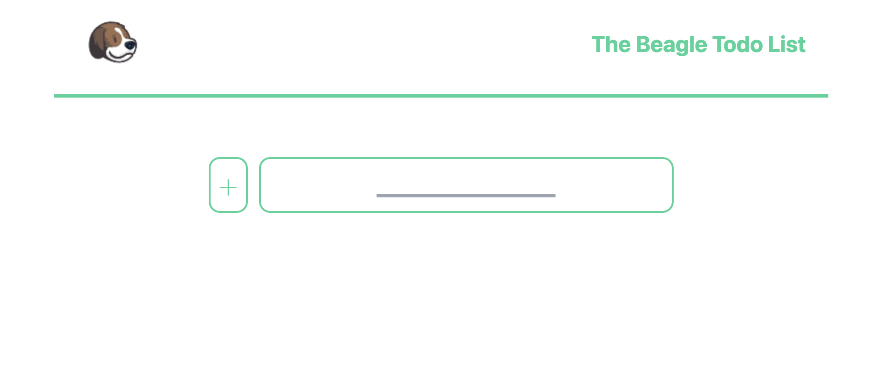

# Todo React App

In this project, I have created a ToDo App in two different versions. You can create a task and add it to your list. The task can be added in two ways. You can either click the `plus` button on the left side of the input or you can press the enter key. After the task is populated you can delete it by pressing the <b>X</b> button on its left side or you can edit it furthermore by pressing in the box. Its value will appear in the input field and you simply change anything you want and confirm the chance either by pressing the enter button or the plus button on its left. The list is also saved in the `local storage` of the browser so even if you refresh the page you won't lose your tasks. I have created a custom hook for implementing this functionality named `useLocalStorage`. You can find it in the <b>utils</b> folder.

I have created 2 versions of this app stored in different branches in the <b>Github</b> repository. The main branch is storing the simple version in which I'm passing props into different components so I can control the state of the application. In the second version stored in the `context_API` branch I'm using the <b>Context API</b> provided from <b>React</b> package. I am creating a Context Javascript object using the `useContext` hook and its functions so I can hold the state at the top level of the application. In this way, the state is accessible at any level without needing to pass the props unnecessarily to other components. I am also using `CRACO` which is a package that allows me to override the configuration layer for a create-react-app so I can use TailwindCSS. I have added a validation field in the input field so it cannot be submitted without any text typed in the input field of the form. I thought of adding the ErrorBoundary package which grabs the whole application and renders the possible errors but I haven't seen the need in this small application so that's why I chose not to include it in this project.

I have seperated all the css into its own variable inside the <b>styles</b> folder for re-usability. I have added animation to the todo being populated after submitting. It was a requirement but I thought it will be a good extra thing to add.

## BUILD WITH

- ReactJs
- Context API
- React Hooks
- Tailwind CSS
- CRACO
- UUID
- Font Awesome Icons

# SETUP

- `git clone git@github.com:mariosknl/todo_react.git`
- `npm install` to install the dependencies of this project
- `npm start` (be sure to be in the `main` branch for the <b>1st</b> version of the application.)
- stop the server by pressing `control+c` in your keyboard.
- `git checkout context_API` to navigate to the 2nd branch where you can check the 2nd version mentioned about.
- `npm start`

# AUTHOR

- Github: [@mariosknl](https://github.com/mariosknl)
- Twitter: [@mariosknl](https://twitter.com/MariosKnl)
- Linkedln: [marios-kanellopoulos](https://www.linkedin.com/in/marios-kanellopoulos)
- Portfolio: [marios-kanellopoulos](https://marioskanellopoulos.com/)

# Show your support

Give ⭐️ if you like this project!

# Acknowledgments

- Microverse

### 🤝 Contributing

Contributions, issues, and feature requests are welcome!
Feel free to check the issues page.
